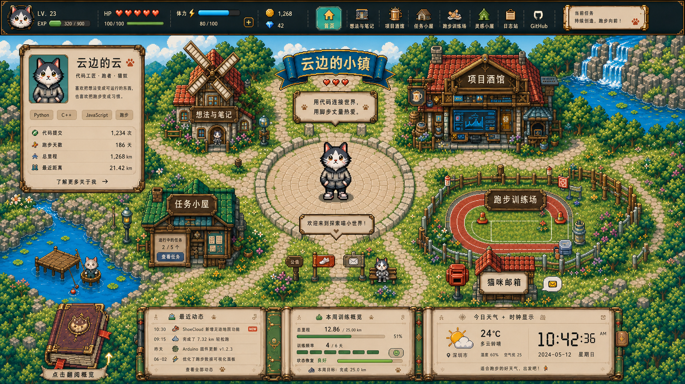

# 云边的小镇 - 像素风个人网站

一个以像素风小镇为主视觉的个人网站项目。网站把个人主页、作品展示、技术笔记、跑步记录和任务日志包装成一张可探索的小镇地图，让访问者像进入一款轻量 RPG 一样了解站主的技术能力、项目经历和日常状态。



## 项目定位

`云边的小镇` 是一个全栈个人网站，核心目标不是做传统简历页，而是把个人品牌、作品集和数据看板组合成一个有互动感的像素世界。

适合承载：

- 个人介绍与技能标签
- 项目作品集与案例详情
- 技术文章、灵感笔记和日志
- 跑步训练数据与周报
- GitHub 动态、提交统计和任务进度
- 天气、时间、待办等生活化状态信息

## 视觉概念

概念图采用明亮白天场景，整体像素风格偏温暖、清爽、可探索。

主要视觉元素：

- 顶部状态栏：头像、等级、经验值、HP、体力、金币、宝石和导航入口
- 中央小镇地图：河流、瀑布、树林、石路、风车、建筑和训练场
- 个人信息面板：昵称、身份、技能标签、代码提交、跑步数据等
- 功能建筑入口：想法与笔记、项目酒馆、任务小屋、跑步训练场、日志站、GitHub
- 底部信息面板：最近动态、本周训练概览、天气和时钟
- 猫咪角色：作为站主虚拟形象和页面引导角色

## 功能规划

### 首页地图

- 展示像素风小镇全景
- 建筑和图标作为功能入口
- 支持鼠标悬停、点击进入模块
- 支持当前任务、欢迎语和个人状态提示
- 适配桌面端横向沉浸式浏览

### 个人档案

- 展示头像、昵称、身份标签和简介
- 展示技能标签，例如 Python、C++、JavaScript、跑步
- 展示关键统计数据：
  - 代码提交次数
  - 跑步天数
  - 总里程
  - 最近距离

### 项目酒馆

- 展示个人项目列表
- 支持项目分类、技术栈筛选和详情页
- 每个项目包含：
  - 项目封面
  - 项目简介
  - 技术栈
  - GitHub 地址
  - 在线预览地址
  - 开发日志

### 想法与笔记

- 记录技术文章、学习笔记和灵感片段
- 支持 Markdown 内容
- 支持标签、归档、搜索和阅读量统计

### 任务小屋

- 展示当前正在推进的任务
- 支持任务状态：待办、进行中、已完成
- 可和项目、日志、训练记录关联

### 跑步训练场

- 展示跑步日历、周训练概览和里程进度
- 支持记录距离、配速、时长、天气和体感
- 将训练进度映射成角色体力、等级或徽章

### 日志站

- 展示日常开发日志和版本记录
- 支持按日期查看
- 可作为个人网站的 changelog

### GitHub 动态

- 展示最近提交、仓库、贡献统计和项目入口
- 可通过 GitHub API 定时同步

## 技术栈建议

### 前端

- React 或 Vue
- TypeScript
- Vite
- Tailwind CSS 或 CSS Modules
- Canvas / PixiJS 用于地图交互和像素场景
- Framer Motion 或 CSS Animation 用于轻量动效

### 后端

- Node.js + NestJS / Express
- REST API 或 GraphQL
- JWT / OAuth 用于后台登录
- GitHub API 集成
- 天气 API 集成

### 数据库

- PostgreSQL：项目、文章、任务、训练记录
- Redis：缓存 GitHub 动态、天气和统计数据
- Prisma：数据库建模和迁移

### 部署

- 前端：Vercel / Netlify / 静态资源站点
- 后端：Railway / Render / Fly.io / 云服务器
- 数据库：Supabase / Neon / Railway PostgreSQL
- 对象存储：Cloudflare R2 / S3，用于图片和附件

## 目录结构建议

```text
.
├── apps
│   ├── web              # 前端像素风个人网站
│   └── api              # 后端 API 服务
├── packages
│   ├── config           # 共享配置
│   ├── database         # Prisma schema 和数据库访问
│   └── ui               # 共享 UI 组件
├── public
│   └── assets           # 像素图、角色、建筑、图标
├── docs                 # 设计文档和接口文档
├── README.md
└── 概念图-白天.png
```

当前仓库仍处于概念验证阶段，已有 `index.html` 和概念图资源。后续可以按上面的结构逐步演进为完整全栈项目。

## 页面信息架构

```text
首页
├── 个人档案
├── 想法与笔记
│   ├── 文章列表
│   └── 文章详情
├── 项目酒馆
│   ├── 项目列表
│   └── 项目详情
├── 任务小屋
├── 跑步训练场
├── 日志站
├── GitHub
└── 猫咪邮箱
```

## 数据模型草案

### UserProfile

- `id`
- `nickname`
- `title`
- `bio`
- `avatarUrl`
- `level`
- `experience`
- `hp`
- `stamina`
- `coins`
- `gems`

### Project

- `id`
- `name`
- `slug`
- `summary`
- `description`
- `coverUrl`
- `techStack`
- `repoUrl`
- `previewUrl`
- `status`
- `createdAt`
- `updatedAt`

### Post

- `id`
- `title`
- `slug`
- `content`
- `tags`
- `type`
- `publishedAt`
- `viewCount`

### Task

- `id`
- `title`
- `description`
- `status`
- `priority`
- `projectId`
- `dueDate`

### RunRecord

- `id`
- `distance`
- `duration`
- `pace`
- `weather`
- `feeling`
- `startedAt`

## API 草案

```text
GET    /api/profile
GET    /api/projects
GET    /api/projects/:slug
GET    /api/posts
GET    /api/posts/:slug
GET    /api/tasks
POST   /api/tasks
PATCH  /api/tasks/:id
GET    /api/runs/summary
POST   /api/runs
GET    /api/github/activity
GET    /api/weather
```

## 本地开发

当前版本可以直接通过本地静态服务器预览：

```bash
python -m http.server 5173 --bind 127.0.0.1
```

然后访问：

```text
http://127.0.0.1:5173/
```

如果后续迁移为 Vite 前端项目，推荐使用：

```bash
npm install
npm run dev -- --host 127.0.0.1
```

默认预览地址：

```text
http://127.0.0.1:5173/
```

## 开发里程碑

### M1 - 静态首页

- 完成像素风首页布局
- 完成顶部状态栏
- 完成个人信息卡片
- 完成建筑入口和底部信息面板
- 支持基础响应式适配

### M2 - 前端交互

- 建筑入口悬停和点击反馈
- 地图区域局部动效
- 角色闲置动画
- 面板切换和弹窗详情

### M3 - 内容系统

- 项目列表和项目详情
- Markdown 笔记系统
- 日志和任务数据展示
- 后台内容管理入口

### M4 - 后端和数据

- API 服务
- 数据库建模
- 用户后台登录
- GitHub 动态同步
- 跑步数据录入和统计

### M5 - 部署和优化

- 前后端部署
- 图片资源压缩
- SEO 和 Open Graph
- 性能优化
- 移动端体验优化

## 设计原则

- 视觉优先：第一屏必须明确传达像素小镇和个人角色设定
- 信息可读：装饰不能影响文字、数据和入口识别
- 交互轻量：保留游戏感，但不让访问者学习复杂操作
- 内容可维护：项目、文章、任务和训练记录都应由数据驱动
- 可持续扩展：先完成可用版本，再逐步增加动画、后台和自动同步

## 项目愿景

把个人网站做成一个长期生长的小世界。代码、文章、项目、跑步和生活状态都能在小镇里留下痕迹，让访问者看到的不只是简历，而是一个持续行动中的开发者。
